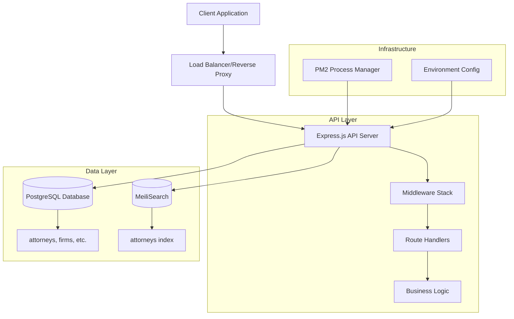

# AmLaw Backend API - Architecture Documentation

## 🏗️ Tech Stack Overview

### Core Technologies
- **Runtime**: Node.js
- **Language**: TypeScript
- **Framework**: Express.js v5.1.0
- **Database**: PostgreSQL
- **Search Engine**: MeiliSearch v0.53.0
- **Process Manager**: PM2
- **Validation**: Zod v4.1.12

### Key Dependencies
```json
{
  "express": "^5.1.0",
  "typescript": "^5.9.3",
  "pg": "^8.16.3",
  "meilisearch": "^0.53.0",
  "zod": "^4.1.12",
  "dotenv": "^17.2.3",
  "cors": "^2.8.5",
  "helmet": "^8.1.0",
  "express-rate-limit": "^8.1.0",
  "compression": "^1.8.1",
  "pino": "^10.0.0",
  "uuid": "^13.0.0"
}
```

## 📁 Project Structure

```
amlaw-backend/
├── src/
│   ├── app.ts                 # Express app configuration
│   ├── server.ts              # Server entry point
│   ├── config/
│   │   └── env.ts            # Environment configuration with Zod validation
│   ├── db/
│   │   └── pool.ts           # PostgreSQL connection pool
│   ├── middleware/
│   │   └── errors.ts         # Error handling middleware
│   ├── modules/
│   │   ├── attorneys/
│   │   │   └── routes.ts     # Attorney-specific routes
│   │   └── search/
│   │       └── routes.ts     # Search functionality routes
│   ├── search/
│   │   └── client.ts         # MeiliSearch client configuration
│   └── routes/               # (Empty - potential for global routes)
├── dist/                     # Compiled JavaScript output
├── ecosystem.v1.cjs          # PM2 configuration
├── package.json              # Dependencies and scripts
├── tsconfig.json             # TypeScript configuration
├── .env.example              # Environment variables template
└── .gitignore               # Git ignore rules
```

## 🔄 Data Flow Architecture



## 🛣️ API Routes Mapping

### Current Routes
```
GET  /health                    # Health check endpoint
GET  /v1/search/attorneys       # Search attorneys with filters
GET  /v1/search/facets          # Get searchable/filterable attributes
GET  /v1/attorneys/:id          # Get attorney by ID (NOT MOUNTED)
```

### Route Details

#### Health Check
- **Endpoint**: `GET /health`
- **Purpose**: System health monitoring
- **Response**: `{ ok: true, time: ISO_STRING }`
- **Caching**: `no-store`

#### Attorney Search
- **Endpoint**: `GET /v1/search/attorneys`
- **Query Parameters**:
  - `q`: Search query (string, default: '')
  - `limit`: Results per page (1-50, default: 20)
  - `offset`: Pagination offset (default: 0)
  - `firm_id`: Filter by firm UUID
  - `office_city`: Filter by office city
  - `practice`: Filter by practice area
- **Response**: `{ items: Attorney[], estimatedTotal: number }`
- **Caching**: `public, max-age=60, stale-while-revalidate=120`

#### Search Facets
- **Endpoint**: `GET /v1/search/facets`
- **Purpose**: Get available search/filter attributes
- **Response**: `{ searchableAttributes: string[], filterableAttributes: string[] }`
- **Caching**: `public, max-age=300`

#### Attorney Details (NOT MOUNTED)
- **Endpoint**: `GET /v1/attorneys/:id`
- **Purpose**: Get individual attorney details
- **Status**: ⚠️ **Route exists but not mounted in app.ts**

## 🏗️ Core Components Breakdown

### 1. Application Bootstrap (`src/app.ts`)
```typescript
export function buildApp(): Express {
  const app = express();
  app.use(express.json());
  app.get('/health', healthHandler);
  app.use('/v1/search', searchRouter);
  // ⚠️ Missing: attorneysRouter mount
  return app;
}
```

### 2. Environment Configuration (`src/config/env.ts`)
- **Validation**: Zod schema validation
- **Required Variables**:
  - `PGHOST`, `PGPORT`, `PGDATABASE`, `PGUSER`, `PGPASSWORD`
  - `MEILI_HOST`, `MEILI_API_KEY`
  - `PORT`, `NODE_ENV`, `CORS_ORIGINS`

### 3. Database Layer (`src/db/pool.ts`)
- **Connection Pool**: PostgreSQL with max 10 connections
- **Configuration**: Environment-based connection parameters

### 4. Search Layer (`src/search/client.ts`)
- **Client**: MeiliSearch client instance
- **Index**: `attorneys` index for search operations

### 5. Route Modules
- **Search Module**: Attorney search and facets
- **Attorneys Module**: Individual attorney details (not mounted)

## 🔧 Current Deployment Setup

### PM2 Configuration (`ecosystem.v1.cjs`)
```javascript
{
  name: "amlaw-api-v1",
  cwd: "/opt/amlaw-api-v1",
  script: "dist/server.js",
  interpreter: "node",
  watch: false,
  env: {
    NODE_ENV: "production",
    PORT: "5050",
    // Database and search configurations
  }
}
```

### Build Process
```bash
npm run build    # Compile TypeScript to dist/
npm start        # Run compiled JavaScript
npm run dev      # Development with nodemon + ts-node
```

## 🗄️ Database Schema (Inferred)

### attorneys Table
```sql
CREATE TABLE public.attorneys (
  attorney_id UUID PRIMARY KEY,
  full_name VARCHAR,
  firm_id UUID,
  title VARCHAR,
  office_city VARCHAR,
  headshot_url VARCHAR,
  practice_areas TEXT[] -- Array of practice areas
);
```

### MeiliSearch Index
- **Index Name**: `attorneys`
- **Searchable Attributes**: Configured via MeiliSearch settings
- **Filterable Attributes**: `firm_id`, `office_city`, `practice_areas`

## 🔍 Search Architecture

### Search Flow
1. Client sends search request to `/v1/search/attorneys`
2. Query parameters validated with Zod schema
3. Filters constructed for MeiliSearch
4. Search executed against `attorneys` index
5. Results returned with pagination metadata

### Filter Construction
```typescript
const filters: string[] = [];
if (q.firm_id)     filters.push(`firm_id = ${JSON.stringify(q.firm_id)}`);
if (q.office_city) filters.push(`office_city = ${JSON.stringify(q.office_city)}`);
if (q.practice)    filters.push(`practice_areas = ${JSON.stringify(q.practice)}`);
```

## 🚦 Middleware Stack

### Current Middleware
1. `express.json()` - JSON body parsing
2. Route handlers
3. Error middleware (defined but not used)

### Missing Middleware
- CORS configuration
- Helmet security headers
- Rate limiting
- Request logging
- Compression
- Authentication/Authorization

## 🔐 Security Considerations

### Current Security Measures
- Input validation with Zod schemas
- UUID validation for IDs
- SQL parameterized queries (prevents SQL injection)

### Security Gaps
- No CORS configuration applied
- No security headers (Helmet not applied)
- No rate limiting applied
- No authentication/authorization
- No request logging
- Environment variables in PM2 config (should use .env)

## �� Performance Characteristics

### Caching Strategy
- Health endpoint: `no-store`
- Search results: `public, max-age=60, stale-while-revalidate=120`
- Facets: `public, max-age=300`

### Database Connection
- Connection pooling with max 10 connections
- No connection timeout configuration
- No retry logic

### Search Performance
- MeiliSearch provides fast full-text search
- Pagination support (limit/offset)
- Filter support for targeted queries

## 🔄 Error Handling

### Current Error Handling
```typescript
export function errorMiddleware(err: any, req: Request, res: Response, _next: NextFunction) {
  const status = err.status || 500;
  const code = err.code || (status === 404 ? 'NOT_FOUND' : 'INTERNAL');
  const message = err.message || 'Unexpected error';
  res.status(status).json({ error: { code, message, request_id: (req as any).id || null } });
}
```

### Error Handling Issues
- Error middleware defined but not applied to app
- No request ID generation
- Generic error responses
- No error logging

## 🏃‍♂️ Development Workflow

### Scripts
- `npm run build`: Compile TypeScript
- `npm start`: Run production build
- `npm run dev`: Development with hot reload

### Development Tools
- TypeScript for type safety
- Nodemon for development hot reload
- Rimraf for clean builds

## �� Scalability Considerations

### Current Limitations
- Single process deployment
- No horizontal scaling configuration
- No load balancing
- Fixed connection pool size
- No caching layer (Redis)

### Scaling Opportunities
- PM2 cluster mode
- Database read replicas
- Redis caching layer
- CDN for static assets
- Microservices architecture
